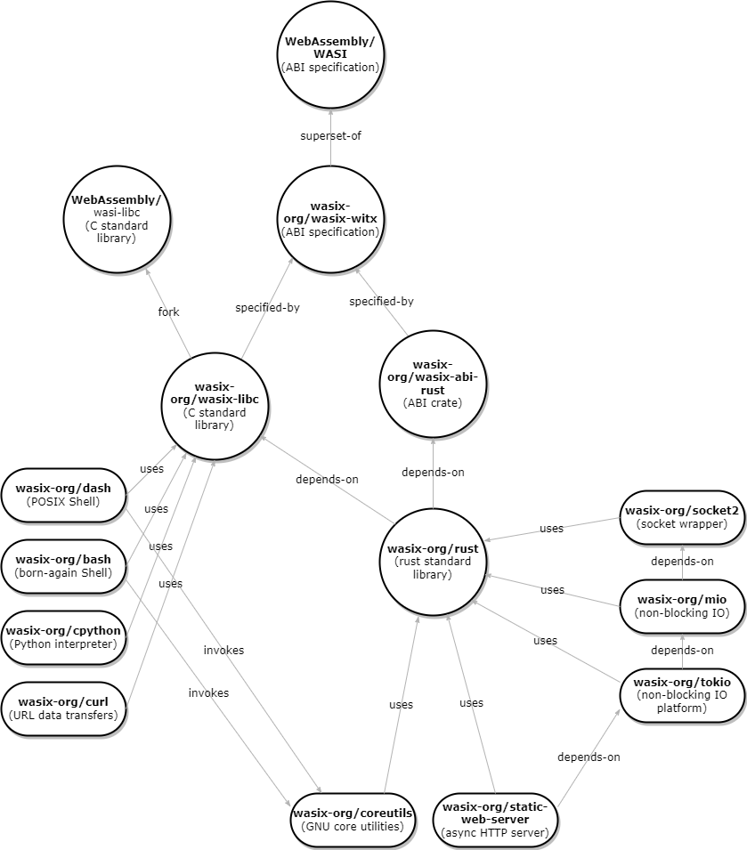

<div align="center">
  <h1><code>WASI(X)</code></h1>

<strong>WASIX adds extensions on WASIX and is managed by the <a href="https://github.com/wasix-org">wasix.org community</a></strong>

  <p>
    <strong>WASI(X) API Bindings for Rust</strong>
  </p>

  <p>
    <a href="https://crates.io/crates/wasix"></a>
    <a href="https://crates.io/crates/wasix"></a>
    <a href="https://docs.rs/wasix/"></a>
  </p>

  <p>
    <strong>WASI API Bindings for Rust</strong>
  </p>

  <p>
    <a href="https://crates.io/crates/wasi"></a>
    <a href="https://crates.io/crates/wasi"></a>
    <a href="https://docs.rs/wasi/"></a>
  </p>

</div>


# WASI(X) Extensions Spec

WASI(X) is maintained by [wasix.org](https://wasix.org).

The intent of WASIX (pronounced "was-x") is to extend the WASI proposal and
complete the ABI sufficiently now to build useful and productive applications
today - it is not intended as a fork but rather to be a superset on top of WASI.
Therefore it maintains full forwards and backwards compatibility with the `preview1`
version of WASI and stabilizes it for the long term.

WASIX is published on [crates.io](https://crates.io)  
https://crates.io/crates/wasix

# Current Extensions

Below are the current extensions supported by WASIX, they are all fully tested and
incorporated into supporting runtime(s):

- full support for efficient multithreading including joins, signals
  and `getpid`
- `pthreads` support (now extended from the WASI threads spec)
- full support for sockets (`socket`, `bind`, `connect`, `resolve`)
    - IPv4, IPv6
    - UDP, TCP
    - Multicast, Anycast
    - RAW sockets
- current directory support (`chdir`) integrated with the runtime
- `setjmp` / `longjmp` support (used extensively in `libc` ) via `asyncify`
- process forking (`fork` and `vfork` )
- subprocess spawning and waiting (`exec` , `wait` )
- TTY support
- asynchronous polling of sockets and files
- pipe and event support (`pipe`, `event` )
- DNS resolution support (`resolve` )

# WASI(X) Contributions

All contributions are welcome on extending WASI(X) with other extension(s). Just submit your pull request
here and we will review via normal GitHub processes.

[https://github.com/orgs/wasix-org/repositories](https://github.com/orgs/wasix-org/repositories)

# Long-term Support

WASIX will receive long term support by this community with a guarantee of backwards compatibility on the ABI.
Runtime(s) that support this ABI are assured of its stability just as standard libraries and libraries can
also count on that same stability to join the dots and make the connections.

Major bug fixes and/or zero day vulnerabilities will be addressed promptly here with careful consideration for
resolving issues without compromising the long-term support goal.

# Dependency Graph



# Usage

First you can depend on this crate via `Cargo.toml`:

```toml
[dependencies]
wasix = "0.11"
```

Next you can use the APIs in the root of the module like so:

```rust
fn main() {
    let stdout = 1;
    let message = "Hello, World!\n";
    let data = [wasix::Ciovec {
        buf: message.as_ptr(),
        buf_len: message.len(),
    }];
    wasix::fd_write(stdout, &data).unwrap();
}
```

Next you can use a tool like [`cargo
wasix`](https://github.com/wasix-org/cargo-wasix) to compile and run your
project:

To compile Rust projects to wasm using WASI, use the `wasm32-wasix` target,
like this:

```
$ wasmer run my-all
   Compiling wasix v0.11.0
   Compiling wasi v0.11.0+wasix-snapshot-preview1
   Compiling wut v0.1.0 (/code)
    Finished dev [unoptimized + debuginfo] target(s) in 0.34s
     Running `/.cargo/bin/cargo-wasix target/wasm64-wasix/debug/wut.wasm`
     Running `target/wasm64-wasix/debug/wut.wasm`
Hello, World!
```

# Development

The bulk of the `wasix` crate is generated by the `witx-bindgen` tool, which lives at
`crates/witx-bindgen` and is part of the cargo workspace.

The `src/lib_generated.rs` file can be re-generated with the following
command:

```
cargo run -p witx-bindgen -- crates/witx-bindgen/WASI/phases/snapshot/witx/wasix_v1.witx > src/lib_generated.rs
```

Note that this uses the WASIX standard repository as a submodule. If you do not
have this submodule present in your source tree, run:
```
git submodule update --init
```

# License

This project is licensed under the Apache 2.0 license with the LLVM exception.
See [LICENSE](LICENSE) for more details.

### Contribution

Unless you explicitly state otherwise, any contribution intentionally submitted
for inclusion in this project by you, as defined in the Apache-2.0 license,
shall be licensed as above, without any additional terms or conditions.
